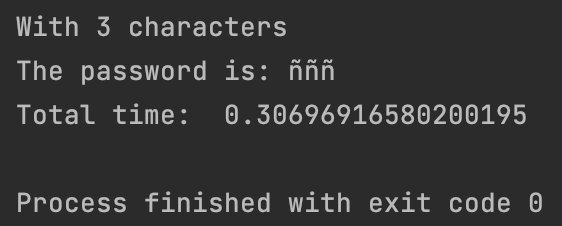
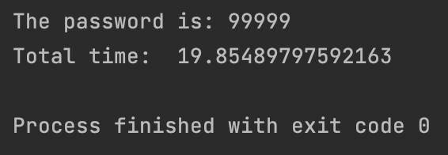
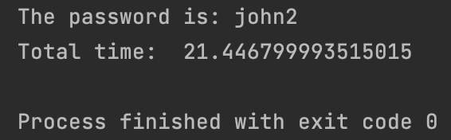

<h2>Introduction</h2>
Keeping our passwords secret is one of the most important things on the Internet today. For this
it is important not to have weak passwords, since today's computers are capable of breaking them easily by brute force*. The code I have created is a small example of how up to 5 character passwords can be discovered in a matter of seconds. 
Only needs the sha256 hash value of the password, and using brute force is capable to found it.

brute force: Trying to identify the password by loop all the possible combinations

<h2>Project</h2>
To break the password only with the hash I have implement a class Password
that needs the hash to break and tries all the possible combinations
using parallel programing. 
It is prepared to search only for characters in lowercase ascii, 
but as arguments you can add characters to search for, or remove if you could discard some, 
but this should be taken into account in the variable "letters" that makes the distribution 
between the processors.

There are in total more than **52.000.000** million possibilities with 5 
letters taking into account the combinations with 3 and 4 letters and the program is capable of solving it in less than 30 seconds.
You can add too a final characters in the solver if you know it.

<h2>Libraries</h2>
I have use hashlib for extract the hash values, multiprocessing for parallel programing and time to obtain the total time of the program.

<h2>Examples of bad passwords</h2>
After differents examples this are the results

