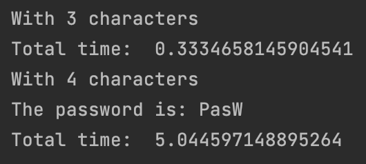

<h2>Introduction</h2>
This python program can found a password with 5 ascii letters in less than 20 seconds by using parallel programing.
Only needs the sha256 hash value of the password, and using brute force is capable to found it.

There are **52.521.875** , not a large number for the actual computers.
This is only an example of how fast can extract weak passwords 

<h2>Libraries</h2>
I have use hashlib for extract the hash values, multiprocessing for parallel programing and time to obtain the total time of the program.

<h2>Results</h2>
After differents examples this are the results

